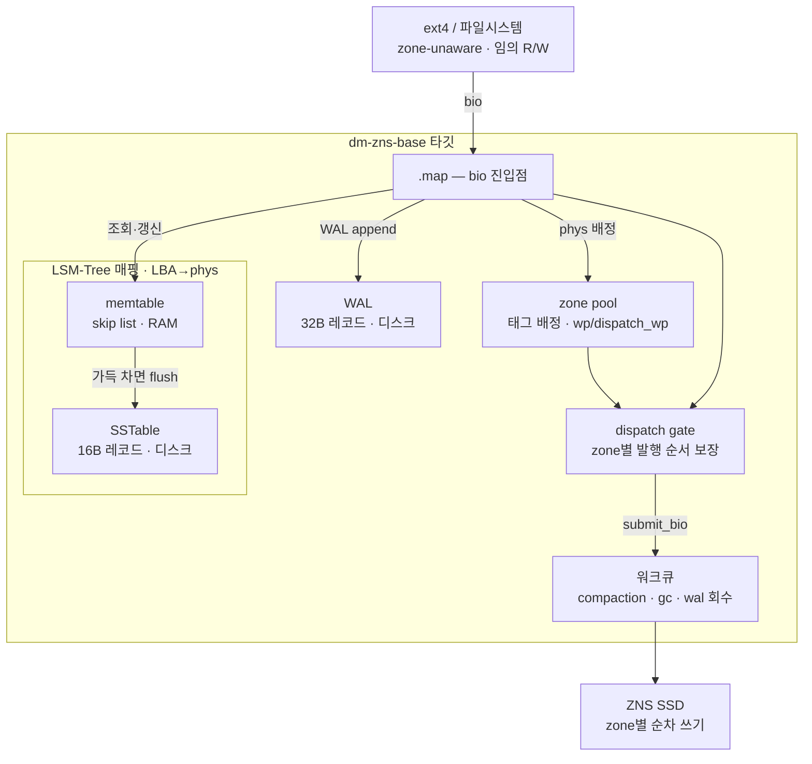
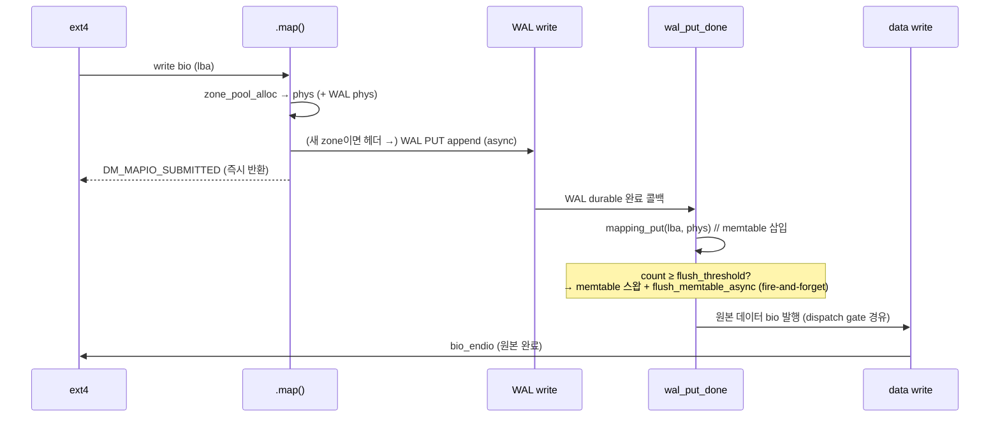
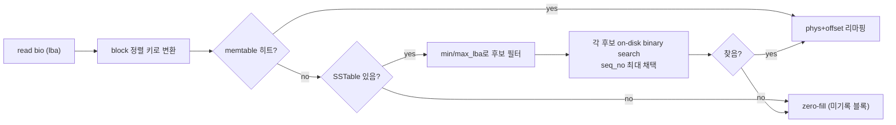

# dm-zns-base

Sequential-only ZNS SSD 위에서 zone-unaware 파일시스템(ext4 등)이 동작하도록,
임의 쓰기(random write)를 순차 쓰기(sequential write)로 변환하는 **LSM-Tree 기반
Device Mapper 타깃**.

> **프로젝트 개요 · 셋업 · Quickstart · 마일스톤 → [docs/project-overview.md](docs/project-overview.md)**
>
> 이 문서(README)는 구현된 타깃의 **아키텍처 · 동작 흐름 · 원리 · 구현 디테일**을 다룬다.

---

## 아키텍처 개요

위 계층(ext4)은 이 타깃을 일반 블록 디바이스로 보고 임의 위치에 읽고 쓴다. 타깃은
그 요청을 받아 **물리적으로는 항상 zone의 write pointer 순서대로만** 디바이스에
내보내고, "어떤 LBA가 어느 물리 섹터에 있는지"를 LSM-Tree 매핑 테이블로 추적한다.



**계층별 역할 한 줄 요약**

| 컴포넌트 | 역할 |
|---|---|
| **zone pool** | 물리 zone을 용도별 태그로 배정, `wp`(배정)·`dispatch_wp`(발행) 추적 |
| **memtable** | 최근 LBA→phys 매핑을 담는 in-RAM skip list |
| **WAL** | 매 쓰기의 매핑을 디스크에 즉시 append — 크래시 복구용 |
| **SSTable** | memtable이 가득 차면 정렬된 매핑을 디스크로 flush한 불변 파일 |
| **compaction** | 오래된 SSTable K개를 병합해 중복 매핑 제거 + read amplification 감소 |
| **GC** | 무효 페이지가 많은 데이터 zone의 산 데이터를 이주시키고 zone 회수 |
| **dispatch gate** | 같은 zone에 쓰는 여러 비동기 I/O의 **실제 발행 순서**를 강제 |

---

## 핵심 자료구조

### Zone pool과 zone 태그

물리 zone은 하나의 pool을 공유하고, 각 zone은 **용도 태그**로 구분된다(전용 zone을
영구히 떼어두지 않고 GC/compaction이 회수 — ZenFS 방식).

```c
enum zone_tag {
    ZONE_TAG_FREE = 0,   // 아무도 안 씀 (kcalloc zero-init → 초기 전부 FREE)
    ZONE_TAG_USER_DATA,  // 사용자 데이터
    ZONE_TAG_GC_DATA,    // GC가 이주시킨 "차가운" 데이터 (Hot/Cold 분리)
    ZONE_TAG_WAL,        // WAL 레코드
    ZONE_TAG_SSTABLE,    // SSTable
    ZONE_TAG_COUNT,      // 배열 크기용
};
```

zone별로 추적하는 두 개의 write pointer가 핵심이다:

| 필드 | 의미 |
|---|---|
| `wp[z]` | **배정된** 섹터 수 (아직 디바이스에 안 나갔을 수 있음) |
| `dispatch_wp[z]` | **실제로 디바이스에 발행된** 섹터 수 (절대 섹터 좌표) |

이 둘을 분리한 이유는 [동시성 모델](#동시성-모델-원리)에서 설명한다.

### LSM-Tree 매핑 (LBA → phys)

매핑은 나이에 따라 세 곳에 나뉘어 산다:

- **memtable** (RAM, skip list): 최근 매핑. 정렬 유지 + O(log n) 조회/삽입.
- **WAL** (디스크): 매 쓰기의 매핑을 즉시 append — memtable은 휘발성이라 크래시
  복구의 유일한 단서.
- **SSTable** (디스크): memtable이 `flush_threshold`개를 넘으면 정렬된 채로
  통째 flush된 **불변** 파일. 오래된 매핑이 여기 영구 보관된다.

> **SSTable은 매핑(주소록)만 담는다** — 실제 4KB 사용자 데이터는 데이터 zone에
> 따로 있고, SSTable 레코드의 `phys`가 그 위치를 가리킨다.

### 온디스크 포맷

이식성을 위해 모든 온디스크 필드는 `__le`(리틀엔디안 고정), 접근 시
`cpu_to_le*/le*_to_cpu`로 변환한다.

**zone_header** — 각 zone 섹터 0. 재적재 후 zone 용도 복원의 단서.

```
0        4        8                16
+--------+--------+----------------+
| magic  |  tag   |      gen       |   magic="ZNSH", tag=enum zone_tag,
| le32   | le32   |     le64       |   gen=WAL zone의 배정 순번(그 외 0)
+--------+--------+----------------+
```

**wal_record** — 고정 32B (512/4096에 나머지 없이 나눠떨어짐).

```
0     4     8         16        24        32
+-----+-----+---------+---------+---------+
|type |resv |          union              |   type: PUT=1 | CHECKPOINT=2
|le32 |le32 |                             |
+-----+-----+---------+---------+---------+
  PUT:        |  lba    |  phys   |  ----   |
  CHECKPOINT: | seq_no  |split_gen|split_off|
```

CHECKPOINT는 memtable 스왑 시점의 WAL 스트림 위치를 `(split_gen, split_off)`
= (활성 WAL zone의 generation, 그 zone 내 다음 쓰기 오프셋)로 남긴다. replay는
이 지점보다 앞선 PUT은 이미 SSTable에 반영됐다고 보고 건너뛴다.

**sstable_header (40B) + sstable_record (16B)** — 헤더 1섹터 뒤로 레코드가 연속.

```
[Header]  magic("SSTB") | reserved | seq_no | record_count | min_lba | max_lba
[Record0] lba | phys        ← 고정 16B라 offset = i*16 으로 binary search 가능
[Record1] lba | phys
...
```

- `seq_no`: 세대 번호. 같은 LBA가 여러 SSTable에 걸칠 때 **최신 판정** 기준.
- `min_lba`/`max_lba`: bloom filter 없이 "이 SSTable엔 그 LBA 없음"을 걸러내는 필터.
- `record_count`: 복구 스캔 시 다음 SSTable 시작 위치 계산에 사용.

### 주요 상수 (모듈 파라미터로 조정 가능)

| 상수 | 기본값 | 의미 |
|---|---|---|
| `BLOCK_SECTORS` | 8 (=4KB) | 매핑 단위 (fio/ext4 블록과 일치, 섹터 대비 8× 절감) |
| `flush_threshold` | 1,000,000 | memtable → SSTable flush 트리거 (엔트리 수) |
| `compaction_k` | 4 | compaction 시 병합할 SSTable 개수 |
| `gc_low_watermark` | 4 | free zone이 이 이하로 떨어지면 background GC 시작 |
| `gc_high_watermark` | 5 | free zone이 이 이상 확보되면 GC 종료(hysteresis) |
| `gc_reserved_zones` | 2 | GC 이주·WAL 전용 예비 zone (데드락 방지) |

---

## 동작 흐름

### 쓰기 경로 (write path)

`.map()`은 **동기적으로 호출되지만 즉시 `DM_MAPIO_SUBMITTED`를 반환**하고, 이후는
비동기 콜백 체인(continuation-passing)으로 진행된다. 원본 데이터 bio는 **WAL이
durable해진 뒤에야** 나간다(매핑이 데이터보다 먼저 복구 가능해야 함).



핵심: 쓰기 요청마다 (1) 데이터 phys와 WAL phys를 **배정**받고, (2) WAL에 매핑을
먼저 durable하게 남긴 뒤, (3) memtable을 갱신하고, (4) 그제서야 데이터를 쓴다.

### 읽기 경로 (read path)



매핑 키는 항상 **`BLOCK_SECTORS` 정렬된 LBA**다 — 커널이 블록 정렬 안 된 위치(예:
ext4 슈퍼블록 프로브, 섹터 2)로 읽을 수 있어서, 반올림 조회 후 `offset_in_block`을
더해 응답한다. SSTable 조회는 전체를 읽지 않고 필요한 512B 섹터만 읽는
on-disk binary search라 거대 할당·read amplification이 없다.

### Flush (memtable → SSTable)

memtable이 `flush_threshold`를 넘으면 `wal_put_done`이 **새 빈 memtable로 교체**하고
옛 memtable을 fire-and-forget로 flush한다(매핑이 WAL에 이미 durable하므로 데이터
bio는 flush를 안 기다림):

```
옛 memtable 정렬 순회 → [헤더+레코드] 직렬화 → SSTABLE zone에 청크로 기록
  → sstable_flush_complete (색인 등록, compaction 트리거 검사)
  → CHECKPOINT 레코드 append (다음 재부팅 때 이 세대 WAL 건너뛰기)
  → checkpoint_write_done (옛 memtable 완전히 해제)
```

### Compaction (SSTable 정리)

SSTable 개수가 `compaction_k`(=4)에 도달하면 백그라운드 워커가 **가장 오래된 K개를
k-way merge**한다 — 각 SSTable은 이미 LBA 정렬돼 있어 재정렬 불필요. 같은 LBA는
`seq_no` 최댓값만 남기고, 밀려난 옛 매핑의 phys는 `invalid_count++`로 GC에 힌트.

```
oldest K개 SSTable 로드 → k-way merge (중복 제거) → 새 SSTable durable 기록
  → 그 다음에만 옛 K개 색인 제거 + 하드웨어 zone reset
```

"durable 먼저, 회수 나중" 순서라 어느 지점에서 크래시가 나도 안전(읽기가 seq_no
높은 것 우선이라 옛것이 잠깐 남아도 결과 불변). **매핑 메타데이터(SSTable zone)만**
회수하며, 실제 데이터 zone은 건드리지 않는다.

### GC (데이터 zone 회수)

free zone이 `gc_low_watermark` 이하로 떨어지면(또는 쓰기가 zone 배정에 실패하면)
백그라운드 GC가 돈다:

```
victim 선정 (invalid_count 최대, greedy)
  → victim에 걸친 산 LBA를 memtable(즉시)·SSTable(현재 위치 재확인 후) 스캔
  → 각 LBA를 GC_DATA zone에 재기록 → WAL 로그 → mapping_put
  → 전부 성공했을 때만 victim zone reset
```

- **victim**: `1 - invalid/사용량`이 가장 낮은(=죽은 페이지 최다) zone. active·100%
  live·발행 미완 zone은 제외.
- **재이주는 WAL에 남긴다**: 이주 매핑이 SSTable로 flush되기 전 크래시 시, replay가
  옛(곧 reset될) 위치가 아니라 새 위치로 복원하도록.
- **Hot/Cold 분리**: 이주 데이터는 사용자 쓰기(USER_DATA)와 분리된 `GC_DATA` zone에
  써서 재무효화를 늦춘다.

### 크래시 복구 (recovery)

재적재(re-insmod) 시 zone reset 없이 상태를 복원한다:

```
blkdev_report_zones → recovery_zone_cb: 각 zone의 tag/wp/dispatch_wp/wal_gen 복원
  → replay_wal_zones: WAL을 generation 순서로 재생 (마지막 CHECKPOINT 이후 PUT만)
  → scan_sstable_zone: SSTable 헤더를 훑어 색인(c->sstables[]) 재구성
```

WAL replay를 물리(zone_id) 순서가 아니라 **generation 순서**로 하는 이유: WAL zone을
회수하기 시작하면 zone_id 순서 ≠ 기록 순서가 되기 때문.

---

## 동시성 모델 (원리)

이 타깃의 가장 어려운 부분. bio 완료 콜백은 **atomic(softirq) 컨텍스트**에서 돌고,
여러 요청이 같은 zone에 동시에 쌓이므로 네 겹의 안전장치가 필요하다.

### 1) 비동기 continuation-passing

`.map()`은 진입점일 뿐 블로킹하지 않는다. 각 단계는 자기 일을 하고 **다음 단계를
콜백으로 등록**한 뒤 반환한다(`submit_*_async` → `*_done` 체인). 단계 사이 상태는
`struct zns_io_ctx`에 실어 넘긴다.

### 2) 단일 spinlock (`c->lock`, `spin_lock_irq`)

모든 공유 상태(zone pool, memtable, SSTable 색인)를 **하나의 spinlock**으로 보호한다.
mutex가 아닌 이유: 이 락을 bio 완료 콜백(atomic 컨텍스트)에서도 잡는데, 거기서
mutex를 잡으면 커널이 죽는다. `_irq` 변형은 process↔softirq 자기교착을 막는다.
임계구역은 짧게(락 안에서 스냅샷만, 실제 I/O는 락 밖) 유지한다.

### 3) 지연 제출 (`submit_bio_deferred` → `zns_wq`)

`submit_bio`조차 atomic 컨텍스트에서 직접 부르면 안 된다 — 큐가 혼잡하면 그 안에서
`wbt`(write-back throttle) 같은 admission control이 스케줄링을 시도해 "BUG:
scheduling while atomic"으로 죽는다. 그래서 **실제 제출은 항상 전용 워크큐 워커
(process 컨텍스트)로 미룬다**.

### 4) Dispatch gate (zone별 발행 순서)

WAL 완료 콜백이 불리는 순서는 커널/디바이스가 정하지, 우리가 WAL을 submit한 순서와
같다는 보장이 없다. 그래서 "배정 순서"(`wp[]`)와 별도로 **"실제 발행 순서"
(`dispatch_wp[]`)**를 추적한다. 어떤 쓰기든 `phys == dispatch_wp[zone]`(자기 차례)일
때만 즉시 나가고, 아니면 대기열에 걸렸다가 앞선 쓰기가 나갈 때 자동으로 풀린다.
이게 없으면 같은 zone에 순서가 뒤바뀌어 발행돼 ZNS 순차쓰기 위반(EIO)이 난다.

> **일반 원칙**: bio 완료 콜백(또는 스핀락 보유 코드)에서 실행되는 모든 경로는
> sleep 가능성이 없어야 한다 — `GFP_ATOMIC`만, 블로킹 I/O·mutex 금지. 동기
> `submit_bio_wait`는 오직 `ctr()`/백그라운드 워커(진짜 process 컨텍스트)에서만 안전.

---

## 크래시 안전성 & 핵심 불변식

- **WAL-first**: 매핑은 데이터보다 먼저 durable. 복구가 데이터 위치를 항상 알 수 있음.
- **회수는 마지막에**: compaction/GC 모두 "새 것 durable → 그 다음에만 옛 zone reset".
  중간 크래시에도 읽기 결과 불변(seq_no 우선).
- **배정 = 발행 트랜잭션**: 배정받은 phys는 반드시 dispatch까지 도달해야 한다. 중간
  실패(ENOSPC/OOM) 경로는 `zone_dispatch_cancel`로 그 자리를 넘겨줘야 dispatch_wp가
  영구히 멈추지 않는다.
- **회수 대상은 발행 완료 zone만**: `dispatch_wp[z] == z*zone_sectors + wp[z]`여야 그
  zone의 배정분이 전부 발행됐다는 뜻 — 아직 안 나간 쓰기가 있는 zone을 reset하면
  그 쓰기가 유실된다.

자세한 사건 기록(같은 근본 원인이 여러 번 재발한 5+건)은 `report/bugfix-log.md`
(로컬) 참고.

---

## 설계 특성 & 트레이드오프

의도적으로 감수한 선택들 — 무엇을 얻고 무엇을 포기했는지.

- **메모리 상한 vs 조회 지연 (RUM 트레이드오프)**: 매핑을 flat array로 전부 RAM에
  두면 device 크기에 비례해 메모리가 선형 증가해 실 스케일에서 못 버틴다. LSM-Tree는
  최근 매핑만 RAM(memtable), 오래된 매핑은 디스크(SSTable)로 내려 **메모리를 상한**
  짓는다. 대가로 memtable-miss(오래된 LBA) 조회는 디스크 I/O라 RAM 대비 크게 느리다
  — binary search + `min/max_lba` 필터로 "디스크를 몇 번·얼마나" 건드리는지는 줄이지만
  **디스크 접근 자체의 지연은 남는다**. 완화책인 SSTable 블록 캐시는 미구현(향후).
- **정확성 우선, 최적화는 M4로**: WAL은 버퍼링 없이 매 put마다 즉시 기록한다(write
  amplification이 있지만 정확성을 먼저 확보 — group commit/batching은 M4). 매핑 조회를
  "항상 공짜(O(1)·zero I/O)"로 만들지 않는 것도 의도된 선택이다: dm-zoned/F2FS와 공정
  비교하려면 실제 매핑 관리 비용(메모리 제약, flush/compaction/조회 I/O)을 함께 부담해야
  의미가 있다.
- **비동기 우선**: `.map()`이 블로킹하지 않고 `DM_MAPIO_SUBMITTED`로 즉시 반환해 쓰기
  지연을 최소화한다. 대신 콜백 체인·발행 순서 게이트 같은 복잡성을 감수한다([동시성
  모델](#동시성-모델-원리)).

---

## 알려진 한계 / 향후 과제

| 항목 | 내용 |
|---|---|
| **읽기 vs 회수 race** | 읽기가 스냅샷한 phys를 compaction/GC가 그 사이 reset할 수 있음. 참조 카운트/epoch 기반 통합 회수-안전 메커니즘 필요(미도입). |
| **discard 미지원** | `num_discard_bios=0` — 삭제된(덮어쓰지 않은) 블록은 GC가 여전히 live로 보고 이주. tombstone 도입 시 해결(정확성 무관, 공간 효율만). |
| **flush 버퍼 atomic 할당** | flush가 atomic 컨텍스트라 `kzalloc(GFP_ATOMIC)` 통짜 — 큰 `flush_threshold`에선 할당 실패로 flush 포기(데이터는 WAL에 남아 안전). 근본 해결은 flush를 process 컨텍스트로 이전. |
| **단일 락 확장성** | 하나의 spinlock이 병목. finer-grained/lock-free skiplist는 M4 과제. |
| **SSTable 조회 디스크 지연** | memtable-miss(오래된 매핑) 조회가 디스크 I/O라 RAM 대비 느림. hot SSTable 섹터를 캐싱하는 **블록 캐시 미구현** — 도입 시 대부분 완화(향후). |

---

## 빌드 & 테스트

```bash
sudo bash scripts/nullblk-up.sh    # 샌드박스 zoned 디바이스
cd src && make && cd ..            # 커널 모듈 빌드
sudo bash scripts/test.sh          # 전체 검증
```

개별 시나리오 스크립트:

| 스크립트 | 검증 내용 |
|---|---|
| `test-basic.sh` | pass-through 기본 동작 |
| `test-m1.sh` / `test-m2.sh` | fio 임의쓰기 / ext4 mount |
| `test-crash.sh` | zone reset 없이 재적재 후 데이터 일치 |
| `test-checkpoint.sh` / `test-wal-reclaim.sh` | WAL replay / WAL zone 회수 |
| `test-sstable-read.sh` | SSTable 읽기 경로가 최신 세대 반환 |
| `test-compaction.sh` | SSTable 개수 감소 + 데이터 보존 |
| `test-gc.sh` / `test-gc-crash.sh` | GC 회수 / GC 이주 크래시 안전 |

---

## 문서

이 README는 아키텍처·설계 문서다. 개요·셋업·전체 문서 인덱스는
[docs/project-overview.md](docs/project-overview.md) 참고.

설계 심화 문서:

| 문서 | 내용 |
|---|---|
| [00-overview](docs/00-overview.md) | 과제 배경, dm-zoned / dm-zap 비교, 차별점 |
| [10-lsm-tree-architecture](docs/10-lsm-tree-architecture.md) | 각 구조체가 왜 필요한지(전체 아키텍처) |
| [09-lsm-implementation-plan](docs/09-lsm-implementation-plan.md) | LSM-Tree 구현 순서 |
| [07-milestones](docs/07-milestones.md) | M0 → M4 마일스톤과 성공 기준 |
| [08-references](docs/08-references.md) | 공식 문서, prior art, 참고 자료 |

---

## 소스 구조

```
dm-zns-base/
├── src/
│   ├── dm-zns-base-main.c   DM 타깃 본체 (map/ctr/dtr, WAL/SSTable/compaction/GC)
│   ├── skiplist.c / .h      memtable용 skip list (분리 모듈)
│   └── Makefile
├── scripts/                 nullblk 셋업, 마일스톤별 자동 테스트
├── docs/                    셋업·마일스톤·아키텍처·참고자료
├── report/                  버그 사건 로그, 디버그 노트 (로컬)
├── Vagrantfile              Windows용 자동 VM
└── provision.sh
```

GPL-2.0. 각 소스 파일의 SPDX 헤더 참고.
