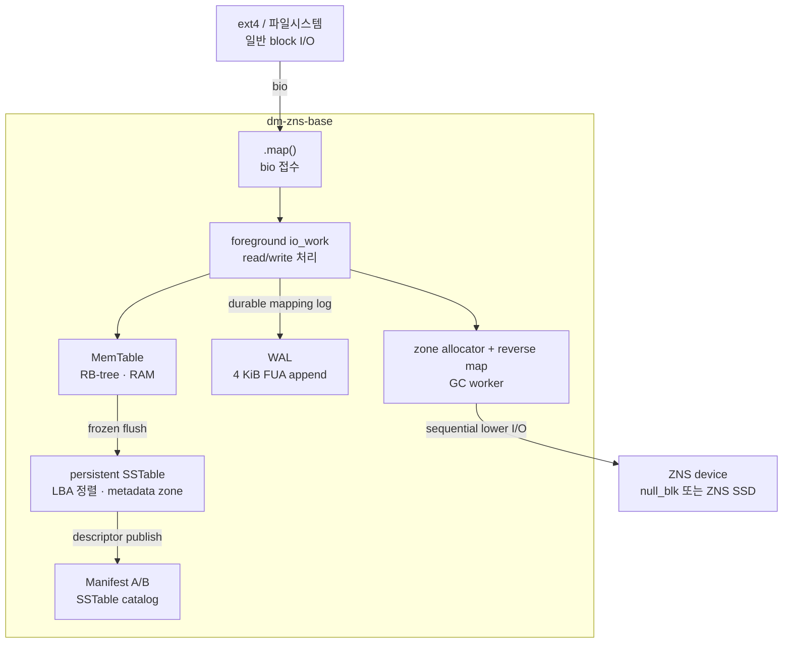
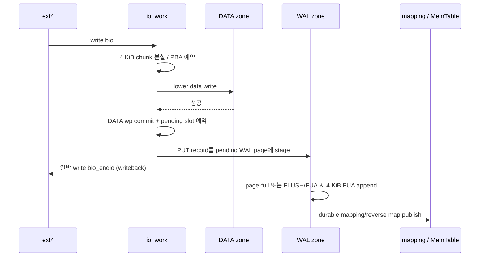

# dm-zns-base

Sequential-write ZNS SSD 위에서 ext4 같은 zone-unaware 파일시스템의 임의 쓰기를
순차 쓰기로 변환하는 **LSM-Tree 기반 Linux Device Mapper 타깃**입니다. 최근 매핑은
RAM MemTable에 유지하고, 오래된 매핑은 persistent SSTable로 flush합니다. WAL,
Manifest A/B, SSTable catalog를 이용해 module reload 뒤에도 매핑을 복구합니다.

> 이 README는 현재 구현된 타깃의 아키텍처와 동작을 설명합니다. 환경 설정은
> [docs](docs)와 각 테스트 스크립트를 참고하세요.

---

## 아키텍처 개요

상위 파일시스템은 이 타깃을 일반 블록 디바이스로 보고 임의 위치에 읽고 씁니다.
타깃은 요청을 4 KiB 논리 블록으로 나누고, 실제 ZNS 디바이스에는 DATA zone의 write
pointer 순서로만 기록합니다.



| 컴포넌트 | 역할 |
|---|---|
| **MemTable** | 최근 `LBA -> PBA` 매핑을 RB-tree로 유지 |
| **WAL** | pending overlay를 durable mapping으로 publish하는 복구 로그 |
| **SSTable** | frozen MemTable을 LBA 순으로 flush한 immutable on-media 매핑 파일 |
| **Manifest A/B** | 현재 유효한 SSTable descriptor 목록과 checkpoint sequence 보관 |
| **zone metadata** | zone 상태, write pointer, valid/pending block, reverse map 관리 |
| **GC worker** | valid 비율이 낮은 DATA zone을 이주하고 reset하여 재사용 |

---

## Zone 배치와 메타데이터

현재 `null_blk` 기본 환경은 64 MiB zone 32개입니다. 앞쪽 6개 zone은 metadata 전용,
나머지는 DATA 용도입니다.

| zone 범위 | 개수 | 역할 |
|---|---:|---|
| 0-1 | 2 | Manifest A/B |
| 2-3 | 2 | WAL |
| 4-5 | 2 | packed persistent SSTable A/B 및 compaction output |
| 6 이후 | 나머지 | 사용자 DATA 및 GC destination |

각 DATA zone은 다음 정보를 RAM에 유지합니다.

```c
struct zns_base_zone {
    sector_t start_sector;
    sector_t capacity_sectors;
    sector_t write_pointer;
    unsigned int valid_blocks;
    unsigned int pending_blocks;
    enum zns_base_zone_state state;
    enum zns_base_zone_role role;
    struct zns_base_zone_slot *slots;
};
```

- `state`: `FREE`, `ACTIVE`, `FULL`, `GC_DEST`, `GC_VICTIM`
- `write_pointer`: 다음 4 KiB 물리 블록을 순차 기록할 위치
- `slots`: zone 내부 4 KiB slot마다 `logical_block`, `valid`, `pending`을 둔 reverse map
- `valid_blocks`: GC victim 선정의 기준이며, overwrite된 이전 PBA는 invalid 처리됩니다.

DATA zone은 `GC_RESERVE_ZONES=2`를 남겨둡니다. free zone이 low watermark 이하가
되면 GC가 실행되어, 일반 write가 모든 free zone을 소모해 GC가 멈추는 상황을 피합니다.

---

## LSM-Tree 매핑

매핑 entry는 다음 세 값입니다.

```c
struct mapping_entry {
    size_t logical_block;      /* 4 KiB 단위 LBA */
    sector_t physical_sector;  /* 실제 DATA zone의 PBA */
    u64 seq;                   /* 최신성 및 recovery 순서 */
};
```

### MemTable

- active MemTable은 현재 write를 받는 사전 할당 RB-tree입니다. 하나의 table은 최대
  4,096개 고유 LBA를 담습니다.
- 같은 LBA overwrite는 기존 node를 갱신하므로 새 node를 소비하지 않습니다.
- MemTable pool은 4개입니다. active table이 가득 차면 spare table을 새 active로
  전환하고 이전 table을 frozen list에 넣습니다.
- flush worker는 frozen RB-tree를 in-order로 읽어 LBA 정렬 SSTable로 기록합니다.
  SSTable과 새 Manifest가 durable하게 publish된 뒤에만 frozen table을 spare pool로
  돌려놓습니다.

### Persistent SSTable과 catalog

- SSTable은 LBA 오름차순 immutable 배열입니다. 각 entry는 `{LBA, PBA, seq}` 24 B입니다.
- Manifest는 현재 유효한 SSTable의 zone, 시작 sector, 길이, LBA 범위, generation,
  payload CRC를 descriptor 목록으로 저장합니다.
- MemTable miss는 Manifest catalog의 SSTable을 `min_lba/max_lba`로 먼저 거르고,
  후보 SSTable에서 필요한 4 KiB page만 읽는 on-disk binary search를 수행합니다.
- 여러 SSTable에서 같은 LBA가 발견되면 가장 큰 `seq`를 선택합니다.
- 여러 SSTable은 현재 SSTable zone 안에 연속 append됩니다. SSTable 수가 4개에
  도달하면 그 zone의 모든 live table을 병합하여 반대편 빈 zone에 기록합니다. 같은
  LBA는 최신 entry만 남기고, 새 Manifest publish 성공 뒤에만 이전 SSTable zone을
  reset합니다. 두 zone은 이 과정을 A/B ping-pong으로 반복합니다.

따라서 runtime lookup 순서는 다음과 같습니다.

```text
pending WAL overlay -> active MemTable -> newest frozen MemTable
-> Manifest catalog의 SSTable on-disk binary search
```

---

## 쓰기 경로

`.map()`은 bio를 pending list에 넣고 `DM_MAPIO_SUBMITTED`를 반환합니다. 실제 처리는
process context의 `io_work`가 수행합니다.



현재 보장하는 순서는 다음과 같습니다.

1. DATA zone에 새 4 KiB 블록을 기록합니다.
2. 실제 data write 성공 후 DATA write pointer를 commit하고 새 slot을 `pending`으로 예약합니다.
3. 일반 write는 WAL PUT을 in-memory pending page에 stage한 뒤 완료합니다. 후속 read는
   pending WAL overlay에서 이 최신 PBA를 찾습니다.
4. page-full, `FLUSH`, `FUA`에서 WAL page를 FUA로 기록한 뒤 `LBA -> new PBA` 매핑,
   새 slot valid, 이전 PBA invalid를 durable하게 publish합니다.
5. flush/FUA 경계에서 WAL 실패 시 해당 durability 요청은 오류로 끝납니다. 일반 write의
   마지막 아직-flush되지 않은 batch는 전원 손실 시 유실될 수 있습니다.

부분 write는 기존 4 KiB를 scratch page에 읽어 온 뒤 해당 바이트만 덮는
read-modify-write 방식입니다. 읽는 동안 대상 zone의 `inflight_reads`를 pin하여 GC가
해당 zone을 reset하지 못하게 합니다.

> WAL은 최대 126개의 32 B PUT record를 하나의 4 KiB page에 묶어 FUA로 기록합니다.
> 일반 write는 timer 없이 pending WAL overlay까지 stage된 시점에 완료됩니다. page가
> 가득 차거나 `FLUSH`/`FUA`/GC가 durability 경계를 요구할 때만 즉시 기록합니다.
> 따라서 flush/FUA가 성공한 write는 복구되며, 아직 flush되지 않은 일반 write batch는
> writeback cache와 같이 전원 손실 시 유실될 수 있습니다.

---

## 읽기 경로

1. 요청 sector를 4 KiB 정렬 `logical_block`과 block 내부 offset으로 나눕니다.
2. WAL pending overlay를 먼저 확인합니다. data write는 끝났지만 WAL publish 전인
   최신 PBA도 같은 target의 후속 read가 볼 수 있게 하기 위해서입니다.
3. active MemTable -> frozen MemTable -> persistent SSTable 순으로 매핑을 찾습니다.
4. SSTable lookup은 LBA 범위 필터 후 필요한 metadata block만 읽어 binary search합니다.
5. 매핑이 있으면 해당 PBA에서 lower read를 수행하고 필요한 byte range를 반환합니다.
6. 매핑이 없으면 zero-fill합니다.

물리 디바이스의 sector 단위는 512 B이지만, 매핑과 reverse map의 관리 단위는 4 KiB
(`SECTORS_PER_BLOCK=8`)입니다.

---

## WAL, Manifest, SSTable과 복구

### On-media format

온디스크 구조체는 커널 포인터나 `size_t`를 직접 저장하지 않고, 고정 폭 little-endian
필드(`__le16`, `__le32`, `__le64`)를 사용합니다. 주요 metadata에는 magic, format
version, generation/sequence, CRC32C가 포함됩니다.

| 구조 | 크기 | 용도 |
|---|---:|---|
| WAL zone header | 40 B | WAL generation과 record format 식별 |
| WAL PUT record | 32 B | `logical_block`, `physical_sector`, `seq`, CRC |
| WAL page header | 64 B | WAL page record 수 및 payload/header CRC |
| SSTable header | 64 B | entry 수, LBA 범위, 최대 seq, CRC |
| SSTable entry | 24 B | `LBA -> PBA`, `seq` |
| Manifest header | 64 B | checkpoint seq, WAL replay 위치, SSTable descriptor 수 |
| SSTable descriptor | 56 B | SSTable 위치, 범위, generation, payload CRC |

### Frozen flush와 Manifest A/B

MemTable이 가득 차면 frozen table을 새 SSTable로 기록합니다. 이후 새 SSTable을 포함한
descriptor catalog를 다음 Manifest page에 publish합니다. Manifest는 두 zone을 번갈아
기록하며, 새 Manifest가 durable해질 때까지 이전 catalog를 유지합니다.

```text
frozen MemTable -> SSTable durable write -> Manifest A/B catalog publish
-> frozen MemTable을 spare pool로 반환
```

WAL 두 zone이 모두 차면, 현재 active/frozen MemTable과 catalog SSTable을 합친 최신
mapping snapshot을 SSTable로 checkpoint하고 Manifest를 publish한 뒤 WAL zone을 재사용합니다.

### Module reload recovery

target 생성 시 `blkdev_report_zones()`로 실제 zone write pointer를 읽고 다음 순서로
RAM 상태를 재구성합니다.

```text
zone report
-> 최신 valid Manifest 선택
-> Manifest catalog의 모든 SSTable을 복원
-> checkpoint 이후 WAL을 generation 순서로 replay
-> reverse map / valid count / DATA zone state 재구성
-> active DATA zone 및 metadata write pointer 복원
```

WAL 또는 Manifest/SSTable의 CRC 오류는 미완료 tail 또는 손상 metadata로 간주합니다.
failure-injection 테스트는 data-write/WAL/SSTable/Manifest 단계의 실패에서 마지막
durable 상태만 복구되는지 검증합니다.

---

## GC

GC는 foreground I/O와 별도 `gc_wq`에서 실행됩니다.

1. free DATA zone 수가 watermark 이하가 되면 GC를 예약합니다.
2. `FULL` DATA zone 중 `valid_blocks`가 가장 작은 zone을 victim으로 선택합니다.
3. victim의 valid slot마다 reverse map으로 LBA를 찾고, GC destination에 data copy를 씁니다.
4. GC 이동도 WAL에 먼저 durable하게 남긴 뒤 mapping을 조건부 publish합니다.
5. victim의 valid block이 0이고 `inflight_reads`도 0이 되면 `REQ_OP_ZONE_RESET`으로
   reset하여 `FREE`로 돌립니다.

foreground write와 GC가 같은 LBA를 갱신할 수 있으므로 GC는 이전 `(PBA, seq)`가 아직
최신일 때만 mapping을 바꾸는 conditional update를 사용합니다. 이미 foreground write가
더 새 값을 publish했다면 GC copy는 mapping에 연결하지 않은 invalid block으로 남습니다.

---

## 동시성 모델

| 보호 대상 | 동기화 방식 | 이유 |
|---|---|---|
| 매핑, zone state, slot, pending bio list | `c->lock` spinlock | 짧은 공유 상태 갱신 |
| WAL/Manifest/SSTable metadata append | `metadata.lock` mutex | lower I/O를 기다리는 순차 append 직렬화 |
| WAL 순서와 mapping publish | `mapping_wal_lock` mutex | foreground write와 GC의 stale publish 방지 |
| victim reset과 lower read | `inflight_reads` + `read_waitq` | 읽는 중인 old PBA reset 방지 |

I/O worker는 하나의 foreground queue로 ACTIVE zone의 write pointer 순서를 보장하고,
GC worker는 GC destination을 별도로 관리합니다. metadata I/O는 mutex를 잡은 process
context에서 수행하므로 spinlock 안에서 block I/O를 기다리지 않습니다.

---

## 관찰과 테스트

`.status` callback으로 다음 상태를 `dmsetup status <target>`에서 확인할 수 있습니다.

- DATA zone별 `ACTIVE/FREE/FULL/GC_DEST/GC_VICTIM` 개수
- GC 실행/zone reset/moved block 수와 최근 오류
- 현재 WAL zone, generation, 사용 block, staged record, WAL 오류
- persistent SSTable 수, checkpoint sequence/generation, Manifest/SSTable active zone

기본 실행:

```bash
sudo bash scripts/nullblk-up.sh
cd src && make && cd ..

sudo bash scripts/test-m1.sh
sudo bash scripts/test-m2.sh
sudo bash scripts/test-m3.sh
sudo bash scripts/test-wal-recovery.sh
sudo bash scripts/test-wal-recovery-ext4.sh
sudo bash scripts/test-checkpoint-recovery.sh
sudo bash scripts/test-failure-injection.sh
```

| 스크립트 | 검증 내용 |
|---|---|
| `test-m1.sh` | 기본 random write/read, overwrite, persistent MemTable flush, flush bio |
| `test-m2.sh` | 1024 B read, partial overwrite/RMW, ext4 round-trip |
| `test-m3.sh` | zone rollover, metadata 격리, 실제 GC reset/reuse, live-block migration |
| `test-wal-recovery.sh` | module reload 뒤 WAL replay readback |
| `test-wal-recovery-ext4.sh` | ext4 sync/unmount/reload/remount hash 검증 |
| `test-checkpoint-recovery.sh` | persistent SSTable, Manifest A/B rotation, checkpoint 복구 |
| `test-failure-injection.sh` | data/WAL/SSTable/Manifest 실패 및 CRC 복구 경로 |

테스트 정리는 `dmsetup remove <target>`을 먼저 수행한 뒤 module 또는 `null_blk`를
내려야 합니다. target이 mount되었거나 `dumpe2fs` 같은 프로세스가 열고 있으면
`Device or resource busy`가 발생합니다.

`test-m3.sh`는 16 MiB보다 큰 zone을 감지하면 각 DATA zone의 앞 16 MiB만 사용하는
bounded 기능 검증 모드로 자동 실행합니다. 물리 zone 경계와 순차 쓰기 규칙은 그대로 유지하고,
zone rollover와 reset만 작은 유효 용량에서 빨리 발생시킵니다. 전체 2 GiB zone으로
장시간 검증하려면 다음처럼 실행합니다.

```bash
UNDERLYING=/dev/nvme0n1 M3_ZONE_CAPACITY_MIB=full \
sudo -E bash scripts/test-m3.sh
```

---

## 현재 한계와 다음 단계

- WAL group commit은 page boundary와 explicit durability boundary만으로 batch를 만든다.
  timer 기반 추가 지연은 없지만, 일반 write는 writeback semantics를 사용합니다.
- on-disk SSTable lookup은 binary search지만 block cache나 bloom filter가 없어 cold read의
  metadata I/O 비용이 남습니다.
- SSTable compaction은 live table 수가 4개가 되면 현재 packed zone 전체를 병합하는
  단순 정책입니다. level 기반 compaction과 workload-aware scheduling은 아직 없습니다.
- partial write는 즉시 RMW합니다. dirty-block cache/write coalescing이 없습니다.
- GC policy는 최소 `valid_blocks`를 고르는 단순 greedy입니다. copy budget, tail latency
  제어, workload-aware victim selection이 남아 있습니다.
- null_blk 기반 기능 검증은 완료했지만, FEMU 또는 실제 ZNS SSD에서의 성능과 장애 모델
  검증이 필요합니다.

---

## 소스 구조

```text
dm-zns-base/
├── src/
│   ├── dm-zns-base.c    DM target, LSM mapping, WAL, SSTable, recovery, GC
│   └── Makefile
├── scripts/             null_blk 설정 및 자동 테스트
├── docs/                환경 설정, 마일스톤, 참고 자료
├── final.md             최종 설계 정리
└── Vagrantfile          Windows용 VM 환경
```

GPL-2.0. 각 소스 파일의 SPDX 헤더를 참고하세요.
